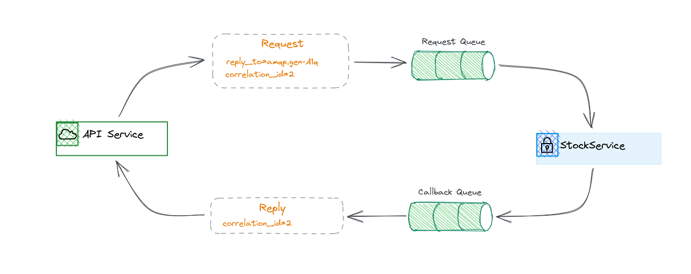
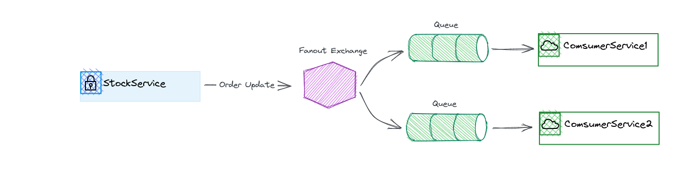

# simple-rabbitmq
A simple RabbitMQ sample with Java to implement the Stock Trading API.

This project uses RabbitMQ as:
1. A RPC system: the method of communication between services (APIService and StockService).
2. A Pub/sub system: send order update messages to all subcribers.
2. A task queue: Limit update DB request/second with queue.


## 1. Use RabbitMQ to build an RPC system.
In this project, we use RabbitMQ to set up RPC as a method of communication between APIService and StockService.



Our RPC will work like this:

1. We will setup a new `DirectExchange`
2. The `APIService` will leverage the `convertSendAndReceive` method, passing the `exchange name`, the `routingKey`, and the `message`.
3. The request is sent to an `Request Queue`.
4. The `StockService` is waiting for requests on that queue. When a request appears, it performs the task and sends a message with the result back to the `APIService`, using the queue from the `replyTo` field.
5. The `APIService` waits for data on the `Callback Queue`. When a message appears, it checks the `correlationId` property. If it matches the value from the request it returns the response to the application.

## 2. Use RabbitMQ to build Publish/Subscribe system.

In this project, we use RabbitMQ to set up Pub/Sub system to broadcast all order updates to all clients.



Once any Order updated, `StockService` send message to an `exchange`. An `exchange` is a very simple thing. On one side it receives messages from producers and the other side it pushes them to `queues`.

## 3. Use RabbitMQ to build a Task Queue.

The main idea behind `Task Queue` is to avoid doing a resource-intensive task immediately and having to wait for it to complete. Instead we schedule the task to be done later. We encapsulate a task as a message and send it to a queue. A worker process running in the background will pop the tasks and eventually execute the job.

In this project, assuming our DB only suffered around 200 request at the same time, that means if more than 200 request at the same time, our DB will die.


## 4. Run project


### 4.1. Setup RabbitMQ
Official RabbitMQ docker image at [https://hub.docker.com/_/rabbitmq](https://hub.docker.com/_/rabbitmq)

```sh
$ cd ./rabbitmq && docker-compose up -d
```
RabbitMQ Server listens on port `5672` as default.

Below are mutual properties between APIService and StockService:
```properties
mq.rabbitmq.queue=stocktrading.queue
mq.rabbitmq.exchange=stocktrading.exchange
mq.rabbitmq.routingkey=stocktrading.routing
mq.rabbitmq.queue.json=stocktrading.queue.json
mq.rabbitmq.routingkey.json=stocktrading.routing.json
mq.rabbitmq.db.task.queue=db.task.queue
mq.rabbitmq.pubsub.queue=pubsub.queue
mq.rabbitmq.pubsub.exchange=fanout.exchange

spring.rabbitmq.host=localhost
spring.rabbitmq.port=5672
spring.rabbitmq.username=user
spring.rabbitmq.password=passw0rd
```

### 4.2. Utils
Project dir: ./Utils. Run `$ mvn install` to build project.

### 4.3. StockService

```sh
$ mvn spring-boot:run
```

### 4.4. APIService
```sh
$ mvn spring-boot:run
```
`RESTful server` listens on port `8081` (see `application.properties` -> `server.port` for more detail).

Available apis:
```
curl --request POST \
  --url http://localhost:8081/api/enterOrder \
  --header 'Content-Type: application/json' \
  --data '{
	"clientID": "C123456",
	"stockID": "AAPL",
	"marketID": "NASDAQ",
	"price": "100.4",
	"qty": "10000"
}'

```
```
curl --request POST \
  --url http://localhost:8081/api/orderEnquiry \
  --header 'Content-Type: application/json' \
  --data '{
	"clientID": "C123456"
}'
```
```
curl --request POST \
  --url http://localhost:8081/api/cancelOrder \
  --header 'Content-Type: application/json' \
  --data '{
	"clientID": "C123456",
	"orders": [
		{
			"orderID": "1"
		},
		{
			"orderID": "2"
		}
	]
}'
```